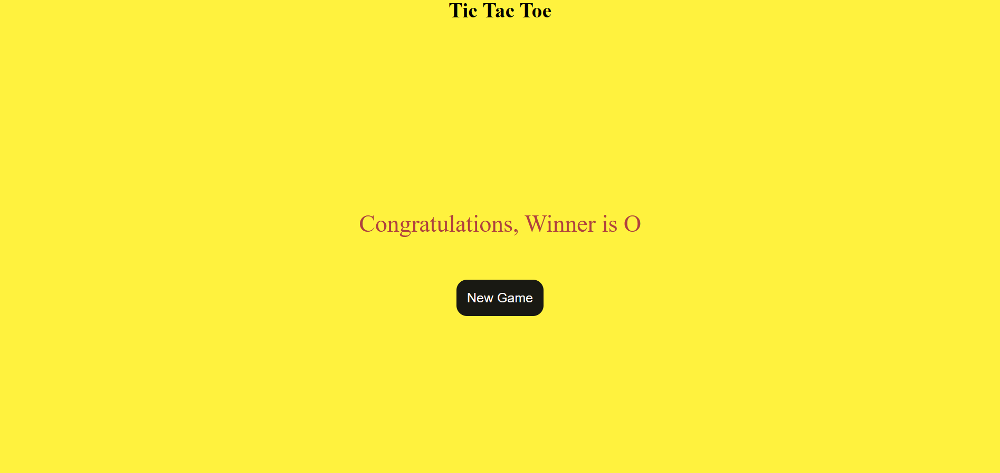
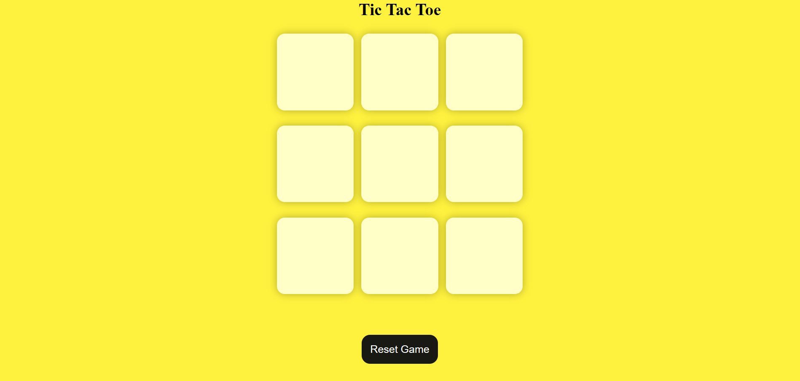

# Tic Tac Toe Game

This is a simple Tic Tac Toe game implemented in a web application. The game
allows two players to play Tic Tac Toe on a 3x3 grid.

## Screenshots

### Game in Progress



### Game Reset



## Features

- **Two Player Mode:** Players take turns to place their mark (X or O) on the
  grid.
- **Winning Detection:** The game detects when a player has won by placing three
  of their marks in a row, column, or diagonal.
- **Reset Game:** Players can reset the game to start a new match.

## How to Play

1. The game starts with an empty 3x3 grid.
2. Players take turns to click on an empty cell to place their mark (X or O).
3. The first player to place three of their marks in a horizontal, vertical, or
   diagonal row wins the game.
4. Click the "Reset Game" button to start a new game.

## Setup

To run the game locally, follow these steps:

1. Clone the repository:
   ```bash
   git clone https://github.com/rohanwani10/Tick-Tack-Toe.git
   ```
2. Navigate to the project directory:
   ```bash
   cd tic-tac-toe
   ```
3. Open `index.html` in your web browser to start the game.

## Technologies Used

- HTML
- CSS
- JavaScript

## Contributing

Contributions are welcome! Please fork the repository and create a pull request
with your changes.

---

## Author

- [Rohan Wani ](https://github.com/rohanwani10)
